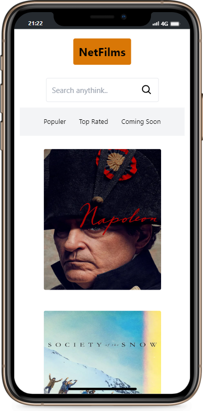

# NetFilms

List daily, popular and upcoming movies using [The Movie DB](https://www.themoviedb.org/). database and view details with NetFilms

## Preview

<div align="center">
  
  
  
</div>

## API KEY

In the config.js file in the app folder, you need to specify the api key you got from themoviedb.

```javascript
const API_KEY = "YOUR_API_KEY";
module.exports = API_KEY;
```

## Installation

#### Clone

```
git clone https://github.com/gorkemuveyk/netfilms.git
```

#### Package Installation

```
npm i
```

#### Start

```
npm run dev
```
